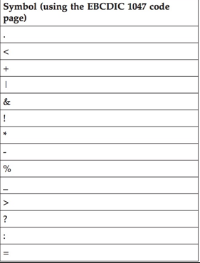

# Running Analytics on z/OS

## Overview

The following instructions can be used to explore analytics applications using IBM Open Data Analytics for z/OS. The analytics examples provided use data stored in DB2 and VSAM tables, and demonstrate machine learning algorithms such as random forest and logistic regression. You will use fictitious customer information and credit card transaction data to learn how a financial organization might analyze their enterprise data to evaluate customer retention.  

   1. The first example demonstrates the Spark-submit function with an application written in Scala.
   2. The second example demonstrates a client retention analysis using a Python 3 notebook.
   3. The third example demonstrates a client retention analysis using PySpark APIs in a Python 3 notebook.

## Architecture
   

## Steps

1. Sign up for an IBM Z Community Cloud account.
2. Log in to the Self Service Portal.
3. Configure your Analytics Instance and upload data.
4. Use case #1: Run a Scala program in batch mode.
5. Use case #2: Run a Python program with Jupyter Notebook.
6. Use case #3: Run a PySpark program with Jupyter Notebook.

## Step 1. Sign up for an IBM Z Community Cloud account

1. If you have not done so already, go to [IBM z Systems Trial Program](http://www-03.ibm.com/systems/z/resources/trials.html) and register for a 30-day trial account. 
2. Select the **Analytics Service on z/OS** trial. 
3. Fill out and submit the registration form.
4. You will receive an email containing credentials to access the self-service portal. This is where you can start exploring all our available services.

## Step 2. Log in to the Self Service Portal

Note: The Mozilla Firefox browser is recommended for these examples.

1. Open a web browser and access the [IBM Z Community Cloud self-service portal](https://zcloud.marist.edu/#/login). 
   
   

    1. Enter your Portal User ID and Portal Password
    2. Click **'Sign In'**
       You will see the home page for the IBM Z Community Cloud self-service portal.  
       
2. Select the **Analytics Service**.

    1. Click **'Try Analytics Service'**
    
   
 
3. You will now see a dashboard, which shows the status of your Analytics instance. 

   
   
   + At the top of the screen, notice the **'z/OS Status'** indicator, which should show the status of your instance as **'OK'**.     
   + In the middle of the screen, the **‘Analytics Instance’**, **‘Status’**, **‘Data management’**, and **‘Operations’** sections will be displayed. The **‘Analytics Instance’** section contains your individual **'Analytics Instance Username'** and IP address.
   + Below the field headings, you will see buttons for functions that can be applied to your instance. 
 
  The following table lists the operation for each function:

  | Function        | Operation                                                  | 
  | --------------- | ---------------------------------------------------------- | 
  | Change Password | Click to change your Analytics Instance password           |
  | Start           | Click to start your individual Spark cluster               |        
  | Stop            | Click to stop your individual Spark cluster                | 
  | Upload Data     | Click to select and load your DDL and data file into DB2   | 
  | Spark Submit    | Click to select and run your Spark program                 | 
  | Spark UI        | Click to launch your individual Spark worker output GUI    | 
  | Jupyter         | Click to launch your individual Jupyter Notebook GUI       | 

## Step 3. Configure your Analytics Instance and upload data

1. For logging in the first time, you must set a new Analytics Instance (Spark on z/OS) password.
    
    1. Click **‘Change Password’** in the **‘Analytics Instance’** section
    
   
    
    2. Enter a **new password** for your Analytics Instance (Spark on z/OS) Please note the following symbols are not allowed in the password:
    
    
    
    3. Repeat the **new password** for your Analytics Instance (Spark on z/OS)
    4. Click **‘Change Password’**
    
   
    
    5. This is your **'Analytics Instance Password'** that will be used for subsequent steps
    
2. Confirm your instance is Active. 

    1. If it is **‘Stopped’**, click **‘Start’** to start it
   
   
 
3. (Optional) The DB2 data for this exercise has already been loaded for you, no further action is required. The DDL and DB2 data file are provided in the [zAnalytics Github repository] for your reference.  

   + DB2 data file: sppaytb1.data
   + DB2 DDL: sppaytb1.ddl
   
   Follow these steps if you wish to upload your own DB2 data.    
    1. Click **‘Upload Data’**        
    
    
    
    2. Select 'DB2'
    3. Select the DB2 DDL file
    4. Select the DB2 data file
    5. Click **‘Upload’**
    
       
 
   This process could take up to five minutes. You will see the status change from **‘Transferring’** to **‘Loading’** to **‘Upload Success’**.  

4. (Optional) The VSAM data for this exercise has already been loaded for you, no further action is required. The VSAM copybook and VSAM data file are provided in the [zAnalytics Github repository] for your reference.  

   + VSAM data file: VSAM.BACKUP.DUMP.TERSE
   + VSAM copybook: VSAM.COPYBOOK
   
   Follow these steps if you wish to upload the example VSAM data. 
    1. Click **‘Upload Data’**
    2. Select 'VSAM'
    3. Select the VSAM copybook
    4. Select the VSAM data file
    5. Enter the original VSAM data file name as shown in the below figure
    6. Enter the target VSAM data file name as shown in the below figure
    7. Enter the virtual table name for your target VSAM data file as shown in the below figure
    8. Click **‘Upload’**
   
       
5. (Optional) You may upload your own Comma Separated Values (CSV) file, which will be stored in your analytics instance’s file system.

   Follow these steps if you wish to upload a CSV file.
    1. Click **‘Upload Data’**
    2. Select 'CSV'
    3. Select your CSV file
    4. Click **‘Upload’**

       
 
## Step 4. Use case #1: Run a Scala program in batch mode

The sample Scala program will access DB2 and VSAM data, perform transformations on the data, join these two tables in a Spark dataframe, and store the result back to DB2.

1. Download the prepared Scala program from the [zAnalytics Github repository] to your local workstation.

    1. Click the **ClientJoinVSAM.jar** file.
    2. Click **Download**.
    
    

2. Submit the downloaded Scala program to analyze the data. 
    
    1. Click **‘Spark Submit’** 
    
       
       
    2. Select the **‘ClientJoinVSAM.jar’** file you just downloaded
    3. Specify Main class name **‘com.ibm.scalademo.ClientJoinVSAM’**
    4. Enter the arguments: <**Your 'Analytics Instance Username'**> <**Your 'Analytics Instance Password'**>   ( Please note this is NOT the username  and password you used to login to the IBM Z Community Cloud! ) 
    5. Click **‘Submit’**
    
       
 
   **“JOB Submitted”** will appear in the dashboard when the program is complete. 

3. Launch your individual Spark worker output GUI to view the job you just submitted.
    
    1. Click **‘Spark UI’**
    
       
       
    2. Authenticate with your **'Analytics Instance Username'** and **'Analytics Instance Password'**    ( Please note this is NOT the username  and password you used to login to the IBM Z Community Cloud! )
    
       
       
    3. Click the **‘Worker ID’** for your program in the **‘Completed Drivers’** section
    
       
       
    4. Authenticate with your **'Analytics Instance Username'** and **'Analytics Instance Password'**     ( Please note this is NOT the username  and password you used to login to the IBM Z Community Cloud! )
    
    5. Click on **‘stdout’** for your program in the **‘Finished Drivers’** section to view your results
    
       
 
   Your results will show:
   
   + the top 20 rows of the VSAM data (customer information) in the first table,
   + the top 20 rows of the DB2 data (transaction data) in the second table, and
   + the top 20 rows of the result ‘client_join’ table in the third table.
   
## Step 5. Use case #2: Run a Python program with Jupyter Notebook
In this section, you will use the Jupyter Notebook tool that is installed in the dashboard. This tool allows you to write and submit Python code, and view the output within a web GUI.

The prepared Python program will access DB2 and VSAM data using the dsdbc driver, perform transformations on the data, and join the two tables in a Pandas DataFrame using python APIs. It will also perform a random forest regression analysis and plot several charts.

The data stored in VSAM consists of 6,001 rows of customer information. The data stored in DB2 consists of 20,000 rows of transaction data. The data is transformed and joined in a Pandas DataFrame, which is used to perform exploratory analyses. A random forest algorithm is then used to predict customer churn.

1. Download the prepared Python example from the [zAnalytics Github repository] to your local workstation.

    1. Click the **Python3_Demo.ipynb** file
    
    
    
    2. Click **'Raw'**
    
    
    
    3. From your browser's 'File' menu, select 'Save Page As...', keep the file name 'Python3_Demo.ipynb', and click 'Save'

2. Launch the Jupyter Notebook service from your dashboard in your browser.
    1. Click **‘Jupyter’**
 
       
 
       You will see the Jupyter Notebook home page.

3. Upload the Jupyter Notebook from your local workstation.    
    1. Click **'Upload'**
       
    2. Select Python3_Demo.ipynb from your local workstation
    3. Click **'Open'**
    4. Click **'Upload'**
       
       

4. Click **'Python3_Demo.ipynb'**
      
      
 
The Jupyter Notebook will connect to your Analytics Instance automatically and will be in the ready state when the Python 3 indicator in the top right-hand corner of the screen is clear. 

The environment is divided into input cells labeled with **‘In [#]:’**.  

5. Execute the Python code in the first cell.
    
    1. Click on the first **‘In [ ]:’**
    
    The left border will change to blue when a cell is in command mode.
    
    2. Click in the cell to edit
    
    The left border will change to green when a cell is in edit mode.

    3. Change the value of USERNAME to your **‘Analytics Instance Username’**
    4. Change the value of PASSWORD to your **‘Analytics Instance Password’**
    
    
 
    5. Click the run cell button as shown below:
    
    

    Jupyter Notebook will check the Python code for syntax errors and run the code for you. The Jupyter Notebook connection to your Spark instance is in the busy state when the Python 3 indicator in the top right-hand corner of the screen is grey. 

    

    When this indicator turns clear, the cell run has completed and returned to the ready state.

    If no error messages appear, the cell run was successful.

6. Click and run the second cell **‘In [ ]:’**.

    If no error messages appear, the cell run was successful.

7.	Click and run the third cell **‘In [ ]:’**.

    If no error messages appear, the cell run was successful.

8.	Click and run the fourth cell **‘In [ ]:’**.

    If no error messages appear, the cell run was successful.

9. Click and run the fifth cell **‘In [ ]:’**.

    The output should be similar to the following:

    

10. Click and run the sixth cell **‘In [ ]:’**.

    The output should be similar to the following:

    

11. Click and run the seventh cell **‘In [ ]:’**.

    If no error messages appear, the cell run was successful.

12. Click and run the eighth cell **‘In [ ]:’**.

    If no error messages appear, the cell run was successful.

13. Click and run the ninth cell **‘In [ ]:’**.

    If no error messages appear, the cell run was successful.

14. Click and run the tenth cell **‘In [ ]:’**.

    If no error messages appear, the cell run was successful.

15. Click and run the eleventh cell **‘In [ ]:’**.

    The output should be similar to the following:

    

16. Click and run the twelfth cell **‘In [ ]:’**.

    If no error messages appear, the cell run was successful.

17. Click and run the thirteenth cell **‘In [ ]:’**.

    If no error messages appear, the cell run was successful.

18. Click and run the fourteenth cell **‘In [ ]:’**.

    If no error messages appear, the cell run was successful.

19. Click and run the fifteenth cell **‘In [ ]:’**.

    The output should be similar to the following:

    

20. Click and run the sixteenth cell **‘In [ ]:’**.

    The output should be similar to the following:

    

21. Click and run the seventeenth cell **‘In [ ]:’**.

    The output should be similar to the following:

    

22. Click and run the eighteenth cell **‘In [ ]:’**.

    The output should be similar to the following:

    

23. Click and run the nineteenth cell **‘In [ ]:’**.

    The output should be similar to the following:

    

24. Click and run the twentieth cell **‘In [ ]:’**.

    If no error messages appear, the cell run was successful.

25. Click and run the twenty-first cell **‘In [ ]:’**.

    If no error messages appear, the cell run was successful.

26. Click and run the twenty-second cell **‘In [ ]:’**.

    If no error messages appear, the cell run was successful.

27. Click and run the twenty-third cell **‘In [ ]:’**.

    If no error messages appear, the cell run was successful.

28. Click and run the twenty-fourth cell **‘In [ ]:’**.

    The output should be similar to the following:

    

29. Click and run the twenty-fifth cell **‘In [ ]:’**.

    If no error messages appear, the cell run was successful.

30. Click and run the twenty-sixth cell **‘In [ ]:’**.

    The output should be similar to the following:

    

## Step 6. Use case #3: Run a PySpark program with Jupyter Notebook
In this section, you will use the Jupyter Notebook tool that is installed in the dashboard. This tool allows you to write and submit Python code, and view the output within a web GUI.

The prepared PySpark program will access DB2 and VSAM data using the jdbc driver, perform transformations on the data, and join the tables in a Spark dataframe using PySpark APIs. It will also perform a logistic regression analysis and create a plot using matplotlib. 

The data stored in VSAM consists of 6,001 rows of customer information. The data stored in DB2 consists of 20,000 rows of transaction data. The data is transformed and joined within a Spark dataframe, which is used to perform predictive analyses. A logistic regression algorithm is then used to evaluate cutomer activity level vs. churn.

1. Download the prepared Python example from the [zAnalytics Github repository] to your local workstation.

    1. Click the **PySpark_Demo.ipynb** file
    
    
    
    2. Click **'Raw'**
    
    
    
    3. From your browser's 'File' menu, select 'Save Page As...', keep the file name 'PySpark_Demo.ipynb', and click 'Save'

2. Launch the Jupyter Notebook service from your dashboard in your browser.
    1. Click **‘Jupyter’**
 
       
 
       You will see the Jupyter Notebook home page.

3. Upload the Jupyter Notebook from your local workstation.    
    1. Click **'Upload'**
       
    2. Select PySpark_Demo.ipynb from your local workstation
    3. Click **'Open'**
    4. Click **'Upload'**
       
       

4. Click **'PySpark_Demo.ipynb'**
      
      
 
The Jupyter Notebook will connect to your Analytics Instance automatically and will be in the ready state when the Python 3 indicator in the top right-hand corner of the screen is clear. 

The environment is divided into input cells labeled with **‘In [#]:’**.  

5. Execute the Python code in the first cell.
    
    1. Click on the first **‘In [ ]:’**
    
    The left border will change to blue when a cell is in command mode.
    
    2. Click in the cell to edit
    
    The left border will change to green when a cell is in edit mode.

    3. Change the value of zOS_IP to your **‘Analytics Instance IP Address’**
    4. Change the value of zOS_USERNAME to your **‘Analytics Instance Username’**
    5. Change the value of zOS_PASSWORD to your **‘Analytics Instance Password’**
    
    
 
    6. Click the run cell button as shown below:
    
    
    
    Jupyter Notebook will check the Python code for syntax errors and run the code for you. The Jupyter Notebook connection to your Spark instance is in the busy state when the Python 3 indicator in the top right-hand corner of the screen is grey. 

    

    When this indicator turns clear, the cell run has completed and returned to the ready state.
    
    If no error messages appear, the cell run was successful.
    
6. Click and run the second cell **‘In [ ]:’**.

   If no error messages appear, the cell run was successful.

7.	Click and run the third cell **‘In [ ]:’**.

    The output should be similar to the following:

    

8.	Click and run the fouth cell **‘In [ ]:’**.

    The output should be similar to the following:

    
    
9.	Click and run the fifth cell **‘In [ ]:’**.

    The output should be similar to the following:

    

10. Click and run the sixth cell **‘In [ ]:’**.

    The output should be similar to the following:

       
    
11. Click and run the seventh cell **‘In [ ]:’**.

    The output should be similar to the following:

       

12. Click and run the eighth cell **‘In [ ]:’**.

    The output should be similar to the following:

    

## Step 7.  Extras
1. You may view a list of packages that are pre-installed in your instance and available to use in your analytics applications.  
   
   From the dashboard, 
   1. Click ‘Which packages can I use with IBM Z Community Cloud?’

    

   2. Click ‘full list’
   
    

      The link will open a GitHub page with a list of installed packages and version numbers.

      If you don’t see a package listed, you may submit a request for review consideration.

   3. Click ‘Let us know!’
   
   
   
   4. Enter the package name and version number you would like to request 

   5.  Enter the reason you are requesting the package

   6. Click ‘Request Package’

   

   7. Click ‘OK’

    

[zAnalytics Github repository]: https://github.com/ibmz-community-cloud/zAnalytics
